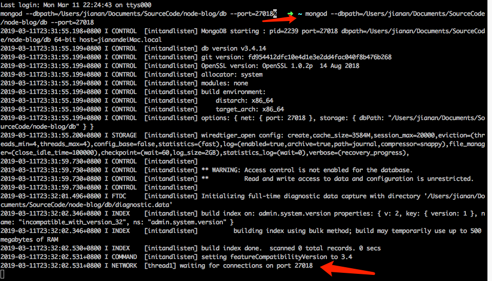
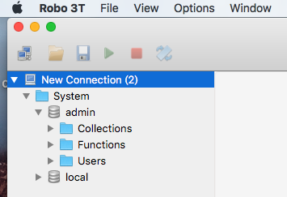

# mongodb数据库的使用

## 1)到mongodb官网下载mongodb数据库

## 2)启动mongodb数据库
*  官网: https://www.mongodb.com
*  启动数据库
```
mongod --dbpath=数据库文件保存路径  如：
mongod --dbpath=/Users/jianan/Documents/SourceCode/node-blog/db --port=27018
```

可见启动后，进入等待连接状态

## 3)Robo 3T可视化终端


## 3)数据保存
*  使用mongoose操作数据库
*  官网:http://mongoosejs.com

## 4)创建model
*  通过Schema创建模型类
*  mongoose.model("模型类名称", Schema);